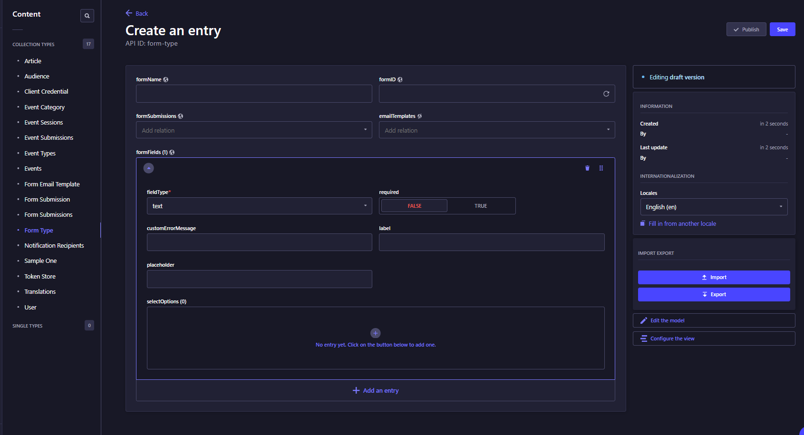

<p align="center">
  
</p>
<h1 align="center">Strapi Plugin Form Builder</h1>

## How to Install

Copy the following code and run from your terminal

```
yarn add strapi-form-builder
```

```
npm i strapi-form-builder
```

## How to Use
Collections required will be created in strapi content-manager.

Create dynamic fields with customizations and use it on your the website.



