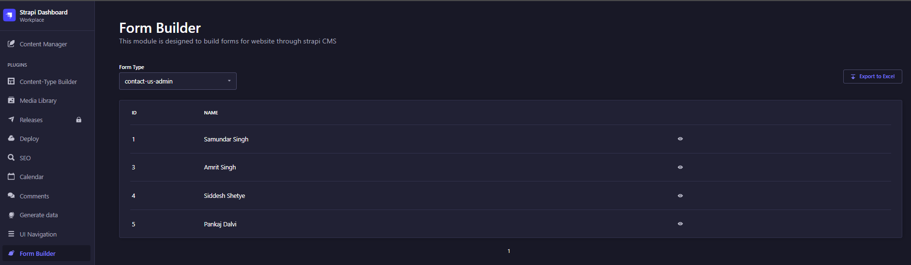

<p align="center">
  
</p>
<h1 align="center">Strapi Plugin Form Builder</h1>

## How to Install

Copy the following code and run from your terminal

```
yarn add strapi-v4-form-builder
```

```
npm i strapi-v4-form-builder
```

## Features Default

### Form Builder

- Create custom form fields from the Content Manager
- Use the Form-Type collection to defince the form fields and form structure
- Submissions can be viewed from the plugin's homepage.
- Based on each Form-Type its corresponding submissions can be viewed  

### Export

- Export data directly from the Content Manager
- Based on each Form-Type, all of its corresponding submissions can be exported to an excel file (.xlsx)





<div style="display: flex; justify-content: space-between; align-items: center; width: 100%;">
  
</div>
